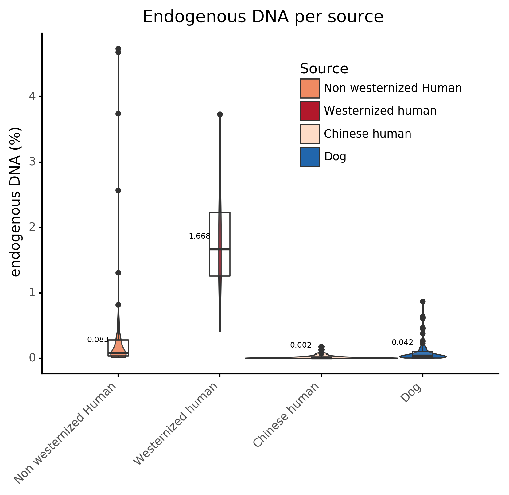

# coproID-article

Analysis scripts for coproID article.

The notebooks used to generate the figures are listed below.  
Use the [conda environment file](environment.yaml) to reproduce the runtime environment:  
`conda env create -f environment.yaml`

## Figures

- [Figure 1](figures/figure1): Pipeline overview  
- [Figure 2](figures/figure2): Host DNA percentage
    - **A**: Human westernized vs Non-Westernized vs Dog
    
- [Figure 3](figures/figure3): Modern population t-SNE embedding
    - **A**: Training set
    - **B**: Training set + test set
- [Figure 4](figures/figure4): Archaeological samples 
    - **A**: Dog vs Human endogenous DNA source classification
    - **B**: t-SNE embedding with archaelogical samples
- [Figure 5](figures/figure5): Combining sourcepredict and Endogenous DNA 

## Tables

- [Table 1](tables/table_1_reference_modern_datasets.xlsx): Reference modern datasets
- [Table 2](tables/table_2_archaelogical_datasets.xlsx): Ancient datasets
- [Table 3](): Host source assignement
- [Supplementary table 1](): Sequencing stats
- [Supplementary table 2](): Archaeological samples - ENA codes
- [Supplementary table 3](tables/table_s3_reference_sample_acc_list.xlsx): Reference samples Accession list 
