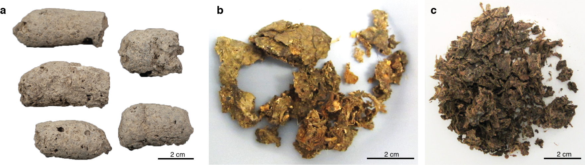
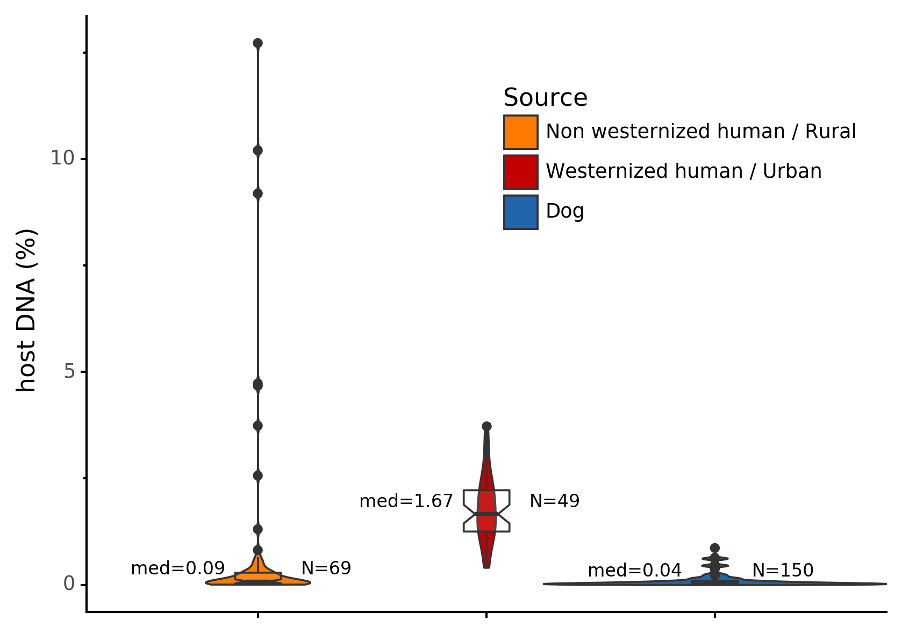

# coproID-article

Analysis scripts for coproID article.

The notebooks used to generate the figures are listed below.  
Use the [conda environment file](environment.yaml) to reproduce the runtime environment:  
`conda env create -f environment.yaml`

## Figures

- [Figure 1](figures/figure1): Coprolites

    
    
- [Figure 2](figures/figure2): Pipeline overview

    
    
- [Figure 3](figures/figure3): Gut Host DNA content

    
    
- [Figure 4](figures/figure4): Host DNA source prediction 

    
    
- [Figure 5](figures/figure5): Sourcepredict embedding  and source prediction of modern samples

    - A: Embedding of training samples

    

    - B: Source prediction

    

- [Figure 6](figures/figure6): Sourcepredict prediction of archaelogical samples.

    

- [Figure 7](figures/figure7-8): coproID source prediction elements
    
    - A: For humans
        
    

    - B: For canids

    

- [Figure 8](figures/figure7-8): coproid source prediction

    
    
- [Figure S1](figures/figureS1): Damage plot

    - A: Non UDG Libraries
    
    
    
    - B: UDG-half Libraries

    